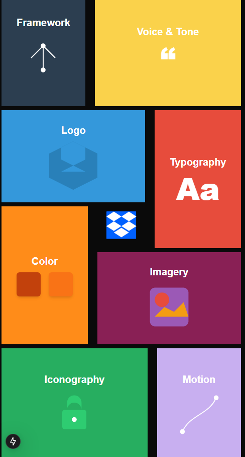

# Dropbox Brand Animation Demo

Live Demo: [https://dropbox-clone-wybh.vercel.app/](https://dropbox-clone-wybh.vercel.app/)

---

## Overview

This project is a modern, responsive animated grid inspired by Dropbox’s brand guidelines.  
It demonstrates advanced UI animation techniques using **React**, **Next.js**, **Tailwind CSS**, and **GSAP** (GreenSock Animation Platform).  
The grid layout and animation logic adapt seamlessly to both desktop and mobile devices, providing a smooth, interactive experience.

---

## Features

- **Responsive Design:**  
  The grid and all UI elements adapt to any screen size, from large desktops to small mobile devices.

- **GSAP Scroll Animations:**  
  Animations are powered by GSAP and ScrollTrigger, allowing for scroll-driven transitions, scaling, and movement of grid elements.

- **Conditional Hover Effects:**  
  Hover effects on grid boxes are only enabled after the main animation sequence completes, providing a guided and interactive user experience.

- **SVG Icon Integration:**  
  The Dropbox logo is used as a favicon and can be displayed in the UI header.

- **Separation of Mobile and Desktop Logic:**  
  The codebase uses separate refs and GSAP timelines for mobile and desktop, ensuring optimal performance and layout on all devices.

---

## How It Works

- **Scroll Animation:**  
  As the user scrolls, GSAP timelines animate the grid and boxes into place.  
  On desktop, the animation is pinned and scrubbed to the scroll position.  
  On mobile, a separate timeline and refs are used for performance and layout.

- **Hover Activation:**  
  The `hoverActive` state is set to `true` only when the scroll animation reaches the end.  
  Only then do boxes respond to hover with scale and shadow effects.

- **SVG Icon:**  
  The favicon is set via the `metadata.icons` field in `layout.tsx`, referencing `/public/dropbox.svg`.

---

## File Structure

- `/src/component/HomePage.tsx`  
  Main component containing the animated grid and GSAP logic.

- `/src/app/layout.tsx`  
  Application layout, metadata, and favicon configuration.

- `/public/dropbox.svg`  
  SVG icon used for the favicon and branding.

- `/README.md`  
  Project overview, setup instructions, and demo images.

- `/PROJECT_DOC.txt`  
  Additional documentation.

---

## Getting Started

1. **Install dependencies:**
   ```bash
   npm install
   # or
   yarn
   # or
   pnpm install
   ```

2. **Run the development server:**
   ```bash
   npm run dev
   # or
   yarn dev
   # or
   pnpm dev
   ```

3. **Open [http://localhost:3000](http://localhost:3000) to view the app.**

---

## Customization

- **To change animation timing or effects:**  
  Edit the GSAP timelines in `HomePage.tsx`.

- **To adjust responsiveness:**  
  Modify Tailwind classes in the JSX for each box.

- **To use a different icon:**  
  Replace `/public/dropbox.svg` and update references in `layout.tsx`.

---

## Credits

- Inspired by Dropbox's brand design.
- Built with React, Next.js, Tailwind CSS, and GSAP.

---

## Demo

See it live: [https://dropbox-clone-wybh.vercel.app/](https://dropbox-clone-wybh.vercel.app/)

