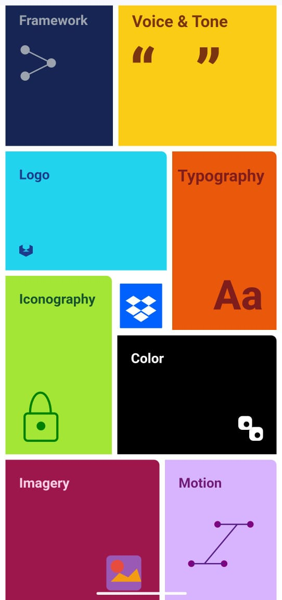

# Dropbox Brand Animation Demo

Live Demo: [https://dropbox-clone-wybh.vercel.app/](https://dropbox-clone-wybh.vercel.app/)

---

## Overview

A modern, scroll-driven animated grid inspired by Dropbox’s brand guidelines, built using:

React (v19)

Next.js (v15)

Tailwind CSS

GSAP + ScrollTrigger

Responsive and interactive across mobile and desktop devices.

---

**Made By - Sayan Kundu**

---

## Features

- **Responsive Grid Layout:**  
Adapts smoothly to all screen sizes, from desktops to mobile.

- **GSAP Scroll Animations:**  
  Timelines animate box transitions based on scroll position, using ScrollTrigger

- **Conditional Hover Effects:**  
  Hover effects activate only after main animations complete, improving focus.

- **SVG Icon Integration:**  
  The Dropbox logo is used as a favicon and can be displayed in the UI header.

- **Separation of Mobile and Desktop Logic:**  
  Mobile and desktop use distinct timelines and refs for better control and performance.

---

## How It Works

- **Scroll-Driven Transitions:**  
 Uses gsap.timeline() and ScrollTrigger to:

Scale the grid.

Transition between sections.

Animate each box into place.

- **SVG Icon:**  
  The favicon is set via the `metadata.icons` field in `layout.tsx`, referencing `/public/dropbox.svg`.

---

## File Structure

Dropbox-clone/
├── public/
│   └── dropbox.svg         # Favicon/logo icon
├── src/
│   ├── app/
│   │   └── layout.tsx      # App layout & metadata
│   ├── assets/
│   │   └── images/         # Demo screenshots
│   └── component/
│       └── HomePage.tsx    # Main GSAP animation logic
├── README.md               # You are here
├── PROJECT_DOC.txt         # Additional docs
├── package.json            # Project config
└── tailwind.config.js      # Tailwind setup


---

## Getting Started

1. **Install dependencies:**
   ```bash
   npm install
   # or
   yarn
   # or
   pnpm install
   ```

2. **Run the development server:**
   ```bash
   npm run dev
   # or
   yarn dev
   # or
   pnpm dev
   ```

3. **Open [http://localhost:3000](http://localhost:3000) to view the app.**

---

## Customization Guide

What you want to change	Where to do it
🎬 Animation speed / effect	HomePage.tsx → GSAP timelines
📱 Responsiveness	Tailwind classes in JSX elements
🖼️ SVG icon	Replace /public/dropbox.svg
🧭 Scroll trigger settings	HomePage.tsx → ScrollTrigger setup

---

## Credits

- Inspired by Dropbox's brand design.
- Built with React, Next.js, Tailwind CSS, and GSAP.

---

## Demo

See it live: [https://dropbox-clone-wybh.vercel.app/](https://dropbox-clone-wybh.vercel.app/)



